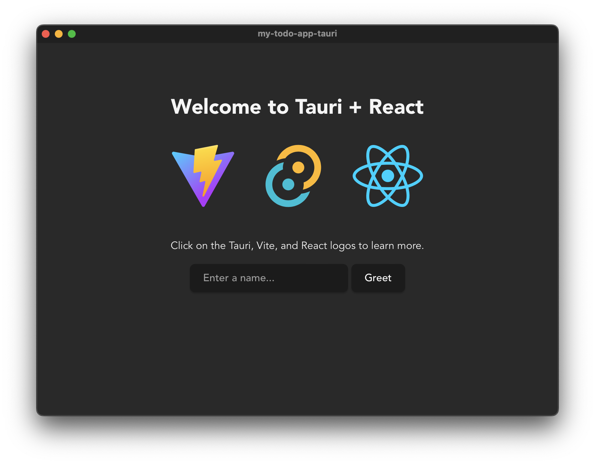

# React App Quick Start

In this tutorial we will build our To-do List App in Typescript, using React with Tailwind and DaisyUI, alongside CO-kit and our [To-do List Core](rust-core-quick-start.md).  
We will use [Tauri](https://tauri.app/) to create a Desktop app that runs using the OS-specific browser.

## Table of Contents

<!-- toc -->

## Requirements

- `tauri-2.7`
- `npm`

## Setup

### Setup NodeJS
We need NodeJS in order to use TailwindCSS within our app.   
Head over to [NodeJS](https://nodejs.org/en/download) for download instructions.

### Setup Tauri

Run the following at the location where the Tauri project should be created:
```sh
npm create tauri-app@latest
```  
The install script will ask for extra information. 

We used the following:
- Project name: `my-todo-app-tauri` 
  - **NOTE**: This will affect the name of the workspace folder, the name of the npm package, and the name of the Cargo package
- [Identifier](https://tauri.app/reference/config/#identifier): `com.1io.examples.todo`
- Frontend language: `Typescript / Javascript`
- Package manager: `npm`
- UI Template: `React`
- UI Flavor: `Typescript`

This creates a new Tauri workspace at this location using React, Typescript and Vite.  
The new directory is both an npm package and the workspace for your new App.  
You can now open it in your IDE of choice.

Browse to this new workspace, and run `npm install`:
```sh
cd my-todo-app-tauri
npm install
```

The following command should now start the bare-bones Tauri project:
```sh
npm run tauri dev
```

Tauri should open a new window that looks like this:



You can now quit this app, and continue below.

***Important Folders:***

- `src` : This will contain all our frontend App components
- `src-tauri` : This contains all Rust-related code and is a Cargo package
- `public` : This is for resources that Vite might need to load at runtime. 
   - This is where the compiled `{core}.wasm` files should go.

### Application
Before we can write our app, we need to install some additional packages and tweak some configs.

1. Install the required npm packages:

```sh
npm i @1io/compare @1io/tauri-plugin-co-sdk-api co-js multiformats react-error-boundary uuid web-streams-polyfill
npm i -D @tailwindcss/cli @tailwindcss/vite @types/node daisyui tailwindcss vite-plugin-wasm
```

2. Initialize Tailwind by adding a `tailwind.css` file to the root:

```css
@import "tailwindcss";
@source "./src/**/*.{rs,html,css}";
@plugin "daisyui";
```

3. Edit the Vite config file (`vite.config.ts`) to work with Tailwind and WASM:

```typescript
// add these imports
import tailwindcss from "@tailwindcss/vite";
import wasm from "vite-plugin-wasm";
~
~// @ts-expect-error process is a nodejs global
~const host = process.env.TAURI_DEV_HOST;

export default defineConfig(() => ({
	plugins: [react(), tailwindcss(), wasm()], // <--- Add these plugins
	// ... leave the rest
	}));
```

4. Add the CO-kit Tauri plugin:

```sh
cd src-tauri
cargo add tauri-plugin-co-sdk --git https://gitlab.1io.com/1io/co-sdk.git --branch main
```

5. The CO-kit Tauri plugin uses async code, so we also need an async runtime.  
We can use Tokio for this:

```sh
cargo add tokio@1.48
```

6. Edit `src-tauri/src/lib.rs` so that it looks like this:

```rust
# // Learn more about Tauri commands at https://tauri.app/develop/calling-rust/
# use tauri_plugin_co_sdk::library::co_application::CoApplicationSettings;
# 
#[cfg_attr(mobile, tauri::mobile_entry_point)]
pub async fn run() {
	tauri::async_runtime::set(tokio::runtime::Handle::current());
	let co_settings = CoApplicationSettings::cli("todo-example-tauri");

	tauri::Builder::default()
		.plugin(tauri_plugin_opener::init())
		.plugin(tauri_plugin_co_sdk::init(co_settings).await)
		.run(tauri::generate_context!())
		.expect("error while running tauri application");
}
```

7. Change the main function in `src-tauri/src/main.rs` to be async:

```rust
# // Prevents additional console window on Windows in release, DO NOT REMOVE!!
# #![cfg_attr(not(debug_assertions), windows_subsystem = "windows")]
# 
#[tokio::main]
async fn main() {
	my_todo_app_tauri_lib::run().await;
}
```

8. Add `co-sdk:default` to the `permissions` field.
   - Tauri has a permissions system. We need to add the `tauri-plugin-co-sdk` permissions to `src-tauri/capabilities/default.json`.  

```json
{
  "$schema": "../gen/schemas/desktop-schema.json",
  "identifier": "default",
  "description": "Capability for the main window",
  "windows": ["main"],
  "permissions": ["core:default", "co-sdk:default", "opener:default"]
}
```

9. (**Optional**) There are a lot of possible settings in the `src-tauri/tauri.conf.json` config file. You can define the starting conditions of the app under `app.windows`: 
   - Adjust `title`, `width` and `height` to your heart's content.
   - Add `"devtools": true` if you are a developer, and you want the app to start with devtools opened.  

```admonish info
The steps below detail how to use CO-Kit to create an App with React.  

However, if you wish to try out the complete React App with Tauri, please see the [Full Example](#full-example) at the end of this page for details on how to get the full code from the git repository.
```

## Implementation

This example To-do app is the same as the [Rust-app example](rust-app-quick-start.md#implementation), but using React instead of Dioxus.

We use the [MyTodoCore](rust-core-quick-start.md).

Upon first starting the application, a `did:key:` identity is created locally.  
We name it `my-todo-identity`.

The first view is where we create to-do lists, and respond to invites.  
The second view is where we manage tasks and participants.

### Application
Instead of the single-file approach used in the example [Rust app](rust-app-quick-start.md), we split the components of this applications across multiple files.  
We also create an extra folder for the types, as you would in a classic React app.

```admonish info
You can delete all of the generated files from the `src` folder, except `vite-env.d.ts`.
```

#### Setup
There is no need to inittialize CO-kit here because the Tauri plugin does that for us.  
Instead we just need to write the code for the frontend.

##### Main
```admonish info
Some code is hidden in the examples below, allowing us to focus on the interactions with CO-kit.  
Make sure to unhide these lines if you want to view or copy the full component code.
```

We start with `main.tsx`:

```typescript
~import React from "react";
~import ReactDOM from "react-dom/client";
~import { App } from "./components/app";
~import "../tailwind.css";
~
ReactDOM.createRoot(document.getElementById("root") as HTMLElement).render(
  <React.StrictMode>
    <div className="bg-base-300 w-screen h-screen">
      <App />
    </div>
  </React.StrictMode>,
);
```

##### Types
Add a `types` subfolder to `src`.

In this folder, create `todo.ts`, which contains all of the types we will need from our Todo Core:

```typescript 
~import { CID } from "multiformats";
~
export type TodoTask = {
  id: string;
  title: string;
  done: boolean;
};

export type TodoCoreState = {
  // CoMap
  tasks: CID;
};

export type TodoAction =
  | { TaskCreate: TodoTask }
  | { TaskDone: { id: string } }
  | { TaskUndone: { id: string } }
  | { TaskSetTitle: { id: string; title: string } }
  | { TaskDelete: { id: string } }
  | "DeleteAllDoneTasks";
```

These should reflect the data model and state as [defined in your Core](/getting-started/rust-core-quick-start.html#1-define-your-data-model-in-a-core).

Next, create a file `consts.ts`, also under `/src/types/`.  
This file contains all const variables, such as the Core name or Identity name:

```typescript
~import { fetchBinary } from "@1io/tauri-plugin-co-sdk-api";
~
export const TODO_CORE_NAME: string = "todo";
export const TODO_IDENTITY_NAME: string = "my-todo-identity";

export async function fetchTodoCoreBinary(): Promise<
  ReadableStream<Uint8Array>
> {
  return await fetchBinary("my_todo_core.wasm");
}
```

We cannot just include the Core WASM bytes like in Rust, so we need to fetch it instead.  
We use the helper function `fetchBinary` from the `@1io/tauri-plugin-co-sdk-api` package for this.  
For this to work, the WASM file must be in the `public` folder (i.e. included in the Vite environment).  
The single argument for this function is the filename of the Core in the `public` folder.

Finally, add an `index.ts` file for exports, also under `/src/types/`:

```typescript
export * from "./todo";
export * from "./consts";
```

##### Components
Add a `components` folder under `src`.

Create an `app.tsx` file in that folder.  
The `App` component handles whether the Overview or a specific Todo list should be shown:

```typescript
~import { ErrorBoundary } from "react-error-boundary";
~import React from "react";
~import { TodoList } from "./todo-list";
~import { TodoOverview } from "./todo-overview";
~import { CoId } from "@1io/tauri-plugin-co-sdk-api";
~import "web-streams-polyfill/polyfill";
~
function Fallback(props: { error: unknown }) {
  return <pre className="p-4">Oops, we encountered an error: {String(props.error)}</pre>;
}

export function App() {
  const [activeCo, setActiveCo] = React.useState<CoId | undefined>();
  const onBack = React.useCallback(() => setActiveCo(undefined), []);
  const onOpen = React.useCallback((coId: CoId) => setActiveCo(coId), []);
  return (
    <ErrorBoundary FallbackComponent={Fallback}>
      {activeCo !== undefined ? <TodoList onBack={onBack} coId={activeCo} /> : <TodoOverview onOpen={onOpen} />}
    </ErrorBoundary>
  );
}
```

Tauri opens a webview using the native browser. Under MacOS this is Safari, where unfortunately async iteration of a `ReadableStream` is unavailable.  
Therefore we need the `import "web-streams-polyfill/polyfill"` import in this root file, so we can iterate the streams from the WASM wrappers on Safari browsers.  

#### Overview View
Next, we want to display a list of To-do Lists and possible invites.

##### Memberships/Invites
We use the Tauri hooks to fetch the membership state in a `/components/todo-overview.tsx` file:

```typescript
~import { useCallback } from "react";
~import { NavBar } from "./nav-bar";
~import { TodoListCreate } from "./todo-list-create";
~import { TodoListElement } from "./todo-list-element";
~import { TODO_IDENTITY_NAME } from "../types/consts";
~import {
~  createCo,
~  pushAction,
~  CoId,
~  Memberships,
~  MembershipsAction,
~  MembershipState,
~  CO_CORE_NAME_MEMBERSHIP,
~  useCo,
~  useCoCore,
~  useCoSession,
~  useDidKeyIdentity,
~  useResolveCid,
~} from "@1io/tauri-plugin-co-sdk-api";
~import { TodoListJoin } from "./todo-list-join";
~
~export type TodoOverviewProps = {
~  onOpen: (coId: string) => void;
~};
~
export function TodoOverview(props: TodoOverviewProps) {
  const localCoSession = useCoSession("local");
  const [localCoCid] = useCo("local");
  const membershipCoreCid = useCoCore(localCoCid, "membership", localCoSession);
  let memberships = useResolveCid<Memberships>(membershipCoreCid, localCoSession)?.memberships;
  const identity = useDidKeyIdentity(TODO_IDENTITY_NAME);

~  // TODO can probably do this better
~  // memberships can be undefined if there is no state yet, but we want an empty array in that case
~  if (membershipCoreCid === null) {
~    memberships = [];
~  }
  const onCreateCo = useCallback(
    async (name: string) => {
      if (identity !== undefined) {
        await createCo(identity, name, false);
      }
    },
    [identity],
  );

  const onJoin = useCallback(
    async (coId: CoId) => {
      if (identity !== undefined && localCoSession !== undefined) {
        const action: MembershipsAction = {
          ChangeMembershipState: { did: identity, id: coId, membership_state: MembershipState.Join },
        };
        await pushAction(localCoSession, CO_CORE_NAME_MEMBERSHIP, action, identity);
      }
    },
    [identity],
  );

  // render
~  return (
~    <div className="flex flex-col h-full">
~      <NavBar left={null} center={<>Todo App</>} right={null} />
~      <div className="grow shrink flex flex-col p-4 gap-4">
~        <div className="grow shrink overflow-y-auto bg-base-100 border-base-300 shadow-sm collapse border">
~          {memberships !== undefined ? (
~            <TodoListCreate showInitially={memberships.length === 0} onCreateCo={onCreateCo} />
~          ) : null}
~          <ul className="list min-h-0">
~            {memberships?.map((membership) => {
~              if (
~                membership.membership_state === MembershipState.Invite ||
~                membership.membership_state === MembershipState.Join
~              ) {
~                return (
~                  <TodoListJoin
~                    key={membership.id}
~                    coId={membership.id}
~                    pending={membership.membership_state !== MembershipState.Invite}
~                    onJoin={onJoin}
~                  />
~                );
~              }
~              if (membership.membership_state === MembershipState.Active) {
~                return <TodoListElement key={membership.id} coId={membership.id} onOpen={props.onOpen} />;
~              }
~              return null;
~            })}
~          </ul>
~        </div>
~
~        <div className="flex-none card bg-base-100 shadow-sm p-2">Your identity: {identity}</div>
~      </div>
~    </div>
~  );
}
```

We open a new session on the local CO. This causes 'fetched' and 'pushed' data to be retained in the memory while the session is open.  
The `useCoSession` hook opens a session the first time it is called, and returns the same session afterwards. It automatically closes the session if the component unmounts. Many other hooks need this session ID to function properly.


The `useCo` hook returns `[stateCid, heads]` of a given CO.  
In this case we only take interest in the state. This is a CID, and we can use it with the `useCoCore` hook.  
It fetches the Core state CID using:
- CO state CID
- a Core name
- the CO session  


The returned `membershipCoreCid` can be resolved using the `useResolveCid` hook. The returned object is of the type `Memberships`, which contains information about all the COs we can interact with. Depending on this state, we render different [list items](#list-items).

```admonish info
Most hooks may returned undefined.  
This is because it uses async tauri commands in the background and therefore data might not be loaded on render time.  
To prevent conditional hook calls, which are forbidden in react, the hooks can be called with undefined arguments.  
In those cases they will return undefined as well.

In a newly created Core, there is no state yet which means the `useCoCore` hook cannot return a Cid. In that case `null` is returned to indicate that a Core exitst but has no state yet.
```

##### Identity
To push an action, or to create a CO, we need an identity.  
We use the `useDidKeyIdentity` hook for that.  
It searches for an identity with the given name or creates a new `did:key` identity with that name if none are found.  
It then returns the DID in string form.


##### Creating a CO
We simply use the `createCo` function to create a CO.  
Creating a CO is a bit special so there is a specific command for it.

We need:
- our Identity
- a name for the CO
- whether it's a public or private CO 

In our example we only create private COs.


##### Joining a CO
We have a handler for joining a CO that we set as prop for the `TodoListJoin` Element.  

We call the `pushAction` function using:
- the local CO session string
- the Core name `CO_CORE_NAME_MEMBERSHIP` we get as a constant from the `@1io/tauri-plugin-co-sdk-api`
- an action that changes the membership state to  `Join`
- our identity

This will then push the join action to the membership Core.

The `ChangeMembershipState` action comes from CO-kit, and we have TypeScript types for it in the `@1io/tauri-plugin-co-sdk-api` package.  
To join a CO that we have been invited to, we need to set our membership status for that CO from `Invite` to `Join`.


##### List items
The possible membership states that are of interest to us are:
- `Active`: Normal active membership
- `Invite`: We were invited to join a [CO](../reference/co.md) by someone else
- `Join`: We accepted an invite and are waiting for it to complete

If the state is `Invite` or `Join`, we show a list element that either has a `Join` button or is marked as pending.

If the state is `Active`, we render a List item that shows the number of undone tasks.  
We set a prop that contains the CO ID, which we get from the membership state.

`todo-list-element.ts`:

```typescript
~import { useMemo } from "react";
~import { TodoCoreState, TodoTask } from "../types";
~import { TODO_CORE_NAME } from "../types/consts";
~import { CoMap } from "co-js";
~import {
~  CoId,
~  useCo,
~  useCoSession,
~  useResolveCid,
~  Co,
~  useCoCore,
~  useBlockStorage,
~  useCollectCoMap,
~} from "@1io/tauri-plugin-co-sdk-api";
~
~export type TodoListElementProps = {
~  coId: CoId;
~  onOpen: (coId: CoId) => void;
~};
~
export function TodoListElement(props: TodoListElementProps) {
  const [coCid] = useCo(props.coId);
  const coSession = useCoSession(props.coId);
  const coState = useResolveCid<Co>(coCid, coSession);
  const todoCoreCid = useCoCore(coCid, TODO_CORE_NAME, coSession);
  const todoState = useResolveCid<TodoCoreState>(todoCoreCid, coSession);

  const storage = useBlockStorage(coSession);
  const taskMap = useMemo(() => {
    if (todoState?.tasks !== undefined) {
      return new CoMap(todoState.tasks.bytes);
    }
    return undefined;
  }, [todoState?.tasks]);
  const tasks = useCollectCoMap<TodoTask>(taskMap, storage);

  const undoneCount = useMemo(() => {
    let count = 0;
    for (const t of tasks.values()) {
      if (!t.done) {
        count++;
      }
    }
    return count;
  }, [tasks]);
~
~  // render
~  return (
~    <li
~      className="list-row flex hover:bg-base-300 rounded-none cursor-pointer after:opacity-5"
~      onClick={() => props.onOpen(props.coId)}
~    >
~      <span className="font-bold flex-1">
~        {coState?.n ?? <span className="loading loading-spinner loading-xs"></span>}
~      </span>
~      {undoneCount > 0 && <div className="badge badge-soft badge-secondary">{undoneCount}</div>}
~    </li>
~  );
}
```

The CO state contains information we need – specifically the name of the CO: `coState?.n`.  
- We use the CO ID (`props.coId`) that we got from the memberships:  
  - to get the `coCid` using `useCo`  
  - to open the `coSession` using `useCoSession`  
- We then resolve the state of the CO (`coState`) using `useResolveCid` with both the session (`coSession`) and the CO CID (`coCid`).  


We want to show how many to-do items in the list are undone, for which we will need the state of the to-do Core: `todoState`.  
- From `useCoCore`, we get the Core CID (`todoCoreCid`) using:
  - `coCid` and `coSession` from before
  - `TODO_CORE_NAME`, which we get from our `const.ts` types
- We then resolve the state of the Core (`todoState`) using `useResolveCid` with both the session (`coSession`) and the Core CID (`todoCoreCid`).  

The Core state contains the tasks, which in TypeScript is a `CID`.  
In Rust it is a `CoMap` instead. A `CoMap` is a map that has the common `BTreeMap` functions, but behind the curtains only contains a root CID, and uses the storage to set/get the linked data.  

The `co-js` package contains a WASM wrapper for the Rust `CoMap`. With this we can use the Rust functions directly.  
- These functions need a `BlockStorage` (named `storage`) that we create with the `useBlockStorage` hook, using our `coSession` from before.  
- We then create a new `CoMap` (named `taskMap`), where the constructor takes our tasks CID in byte form (`todoState.tasks.bytes`).  
- There is no way to directly get all elements of the map, but there is a stream function. We use the `useCollectCoMap` hook to collect the items from the stream into a TypeScript `Map` object named `tasks`. 

Now we just need to filter for unfinished tasks using `tasks.values()`.

#### To-do List
If, for one of our active COs, a list element is opened, we land on this view where all the to-do items of the opened CO are shown.  
We use our hooks and the `CoMap` again to get the data we require:

```typescript
  const session = useCoSession(props.coId);
  const [coCid] = useCo(props.coId);
  const co = useResolveCid<Co>(coCid, session);
  const core = co?.c[TODO_CORE_NAME];
  const coreState = useResolveCid<TodoCoreState>(core?.state, session);

  const identity = useDidKeyIdentity(TODO_IDENTITY_NAME);

  const storage = useBlockStorage(session);
  const taskMap = useMemo(() => {
    if (coreState?.tasks !== undefined) {
      return new CoMap(coreState.tasks.bytes);
    }
    return undefined;
  }, [coreState?.tasks]);
  const tasks = useCollectCoMap<TodoTask>(taskMap, storage);

  const participantMap = useMemo(() => {
    if (co?.p !== undefined) {
      return new CoMap(co.p.bytes);
    }
  }, [co?.p]);
  const participants = useCollectCoMap<Participant>(participantMap, storage);
```

We fetch all particpants of the CO (via `co.p`) because the view of the to-do list contains a `NavBar` that shows the participants.  
There is also a button that opens a dialog from where you can invite new participants.

##### Handlers
In the overview we can create COs, but they will spawn even without a to-do Core.  
We create the function `assureCoreExists`, which checks if a to-do Core exists in the CO, and adds one if not:

```typescript
  // returns false if for any reason it can't be assured if the Core exists
  // most likely because required information isn't loaded yet
  // returns true if Core exists, either because it already did or it was missing but was then created
  const assureCoreExists = useCallback(async () => {
    if (
      storage === undefined ||
      session === undefined ||
      identity === undefined
    ) {
      return false;
    }

    // if CO is undefined, we haven't finished loading yet and don't know if Core is missing
    if (co === undefined) {
      return false;
    }

    // Core exists already
    if (core !== undefined) {
      return true;
    }

    const coreBinaryStream = await fetchTodoCoreBinary();

    const cids = await unixfsAdd(storage, coreBinaryStream);

    if (cids.length === 0) {
      return false;
    }

    const rootCid = CID.decode(cids[cids.length - 1]);

    // add Todo Core
    const createTodoCoreAction = {
      CoreCreate: {
        binary: rootCid,
        core: TODO_CORE_NAME,
        tags: [["type", "my-todo-core"]],
      },
    };
    try {
      await pushAction(session, "co", createTodoCoreAction, identity);
    } catch (e) {
      // error creating Core
      console.log(e);
      return false;
    }
    return true;
  }, [storage, session, identity, co, core]);
```

Because the `MyTodoCore` Core is not a built-in Core, we must first add it to the storage before we can use it.  
- To do this, we call the WASM function `unixfsAdd`. This takes a WASM `BlockStorage`, which we already created, and a binary stream to the Core WASM.  
- `unixfsAdd` returns the CIDs of all created Blocks, where the last one (`rootCid`) is the CID of the Root Block.  
- This is the CID we use when adding the Core to the CO with `CoreCreate`.

Next, we create handlers using the React `useCallback` hook:

```typescript
  const onDeleteAllDone = useCallback(async () => {
    if (identity !== undefined && session !== undefined) {
      if (!(await ensureCoreExists())) {
        return;
      }
      const action: TodoAction = "DeleteAllDoneTasks";
      try {
        await pushAction(session, TODO_CORE_NAME, action, identity);
      } catch (e) {
        setError(e);
      }
    }
  }, [session, identity]);

  const onCreateTask = useCallback(
    async (title: string) => {
      if (identity !== undefined && session !== undefined) {
        if (!(await ensureCoreExists())) {
          return;
        }
        const action: TodoAction = {
          TaskCreate: { done: false, title, id: v7() },
        };
        try {
          await pushAction(session, TODO_CORE_NAME, action, identity);
        } catch (e) {
          setError(e);
        }
      }
    },
    [session, identity],
  );

  const onDone = useCallback(
    async (id: string, done: boolean) => {
      if (session !== undefined && identity !== undefined) {
        if (!(await ensureCoreExists())) {
          return;
        }
        let action: TodoAction;
        if (done) {
          action = { TaskDone: { id } };
        } else {
          action = { TaskUndone: { id } };
        }
        try {
          await pushAction(session, TODO_CORE_NAME, action, identity);
        } catch (e) {
          setError(e);
        }
      }
    },
    [session, identity],
  );

  const onDelete = useCallback(
    async (id: string) => {
      if (session !== undefined && identity !== undefined) {
        if (!(await ensureCoreExists())) {
          return;
        }
        const action: TodoAction = { TaskDelete: { id } };
        try {
          await pushAction(session, TODO_CORE_NAME, action, identity);
        } catch (e) {
          setError(e);
        }
      }
    },
    [session, identity],
  );

  const onEdit = useCallback(
    async (id: string, title: string) => {
      if (session !== undefined && identity !== undefined) {
        if (!(await ensureCoreExists())) {
          return;
        }
        const action: TodoAction = { TaskSetTitle: { id, title } };
        try {
          await pushAction(session, TODO_CORE_NAME, action, identity);
        } catch (e) {
          setError(e);
        }
      }
    },
    [session, identity],
  );

  const onInvite = useCallback(
    async (name: string, did: Did) => {
      if (session !== undefined && identity !== undefined) {
        if (!(await ensureCoreExists())) {
          return;
        }
        // TODO invite action
        const action: CoAction = {
          ParticipantInvite: { participant: did, tags: [["name", name]] },
        };
        try {
          await pushAction(session, "co", action, identity);
        } catch (e) {
          setError(e);
        }
      }
    },
    [session, identity],
  );
```

Our actions are pushed to a to-do Core.
- We first call `ensureCoreExists()` to ensure that a to-do Core exists.  
- We then create Action objects using either the types from the `@1io/tauri-plugin-co-sdk-api` package, or from our own to-do types (`/src/types/todo.ts`).
- The `onInvite` handler is used in the participant-invite dialog.  
- The other handlers just change data in the to-do Core.

The React `ErrorBoundary` cannot catch errors thrown by async callbacks.  
We fix this by saving any errors that occur in a React state, and then throwing them in a sync context on the next render:

```typescript
  const [error, setError] = useState<unknown | undefined>();
  if (error) {
    throw error;
  }
```

Now we just need to render the items in the to-do list:

```typescript
<ul className="list grow shrink overflow-y-auto min-h-0">
  {Array.from(tasks.values()).map((task) => (
    <TodoItem
      key={task.id}
      task={task}
      onDone={onDone}
      onDelete={onDelete}
      onEdit={onEdit}
    />
  ))}
</ul>
```

### Build the App
These commands will build your app:

```sh
npx tailwindcss -i ./tailwind.css -o ./assets/tailwind.css
npm run build
```

### Run the App
Start your app with:
 
```sh
npm run tauri dev
```

(**Optional**) You can set the following environment variables when using the CO-kit Tauri plugin by prepending them to the command above when starting your app:  
- `CO_NO_KEYCHAIN=true` : Set this to `true` if you don't want to save keys to your keychain. 
  - **NOTE**: While this can improve handling during development, by skipping the pop-ups that ask for permission to save the keys, it is **highly unsafe** in production.
- `CO_BASE_PATH={path}` : Change the path where the data is stored.


## Full Example

To have a better structural overview we split the code so that each component lives in its own file.  
As copying the code into this documentation would unnecessarily bloat it, we instead link to a repository where all the code can be viewed.  

You can find the full example in the `my-todo-app-tauri` folder of this git repository:
- [1io / example-todo-list - GitLab](https://gitlab.1io.com/1io/example-todo-list.git)

If you followed the [earlier steps](#setup) to create your example app workspace, these last steps will complete your app:

1. Delete all files from your `src` folder.

2. Copy all files from the `src` folder of the [existing React Todo-List example repository](https://gitlab.1io.com/1io/example-todo-list/-/tree/main/my-todo-app-tauri) into your `src` folder.

3. Copy the WASM file from your Core into the `public` folder as `my_todo_core.wasm`.

4. Then build & run the app using the commands above.

If you skipped the setup steps, you can instead clone the complete repository, which also contains the Todo Core and Rust App. Or you can copy only the `my-todo-app-tauri` folder.
