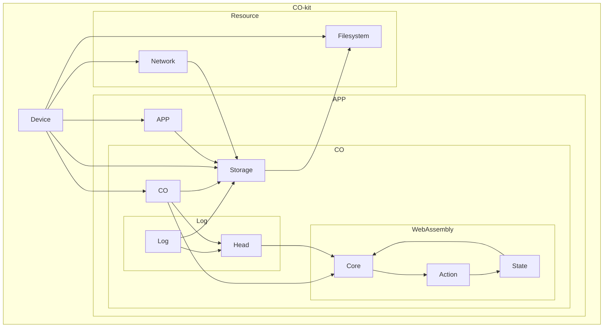

# Architecture
#todo

To ensure interoperability, efficiency and performance, we have made a set of architecture choices that could differ from conventional architectures that you might know from other projects. In this chapter, we explain the system scope and take a closer look at the aforementioned choices.


## System Scope
The system is an SDK built in Rust named CO-kit.
Meant to run on a device and expose APIs for an application.

It manages device resources - filesystem (`F`), network (`N`), internal storage (`S`), logging (`Log`), and a WASM runtime performing logic (`Core`, `Action`, `State`)

**Actors:**
- Device (D): Hosts SDK; has physical access to filesystem, network, internal storage
- APP (B): Higher level client logic using the SDK.

**External Interfaces:**
- File (`F`), network (`N`), internal storage (`S`), logging (`Log`)


## Building Block Overview
### High-Level Components


### Components
- [Device](./usage/os-specifics.md): The platform host.
	- [Network](../reference/network.md): The platform network interface.
	- Filesystem: File based persistence.
	- App: An Application using CO-kit.
		- [Storage](../reference/storage.md): Content addressed storage.
		- [CO](../reference/co.md): Virtual room for collaboration.
		- [Log](../reference/log.md): Conflict-free replicated event stream.
			- Head: Specific point in the Log.
		- [Core](../reference/core.md): Actions to State Reducer.
			- Action: A change operation.
			- State: A materialized state based on the actions.

## Runtime & Development View
**Initialization Flow**:

1. Device boots — enables SDK.

2. `Device → Storage`: Initializes DB.

3. `Device → Filesystem`: Loads WASM modules.

4. APP invokes SDK → CO starts config.


**Operational Flow**:
- `CO` loads WASM `Core (R)`, retrieves `State (M)`, executes `Action (A)` within WASM.

- WASM modifies `State` and requests operations through `CO`.

- `CO` persists new state via `Storage`, logs changes (`Log` → `Storage.Head`).

- Device and APP may read/write storage/files/filesystem concurrently.

- CO may call out for `Network` or `Filesystem` for I/O as directed by WASM logic.

---

## Cross-cutting concepts
- **Persistence & Stateful Execution**
    `Log + Head` provide reliable app state: append-only logs with in-memory head index ensure crash consistency and fast seeks.

- **WASM Isolation**
    Business logic runs sandboxed. Interaction with storage, filesystem, network done via CO APIs exposing capabilities selectively.

- **Concurrency**
    Device, APP, CO, and WASM may execute in separate async contexts—coordination through storage and message channels.

---

## Architecture Decisions
### Logging via Append-Only + Head Index
**Context**: Need for durable state changes.
**Decision**: Use append-only logs with head index for fast access.
**Consequences**: Improves consistency; needs log-compaction.

### Asset Isolation via WASM
**Context**: Risky or volatile business logic.
**Decision**: Embed user logic in WASM.
**Consequences**: Sandboxing improves safety; adds overhead in state management.

### Unified Storage Layer
**Context**: Multiple systems need persistence.
**Decision**: Proxy all reads/writes via `Storage (S)`.
**Consequences**: Single-coordination point; potential bottleneck, but simpler transactions.


---
## Runtime Scenarios
```text
APP → CO: trigger action X
CO → WASM(core): load state M
WASM R executes, calls A to produce new state
WASM → CO: "persist state", "log event"
CO → Storage(S): write state, append log
CO updates Head
CO → WASM(R): acknowledge commit
CO → APP: return action outcome
```

