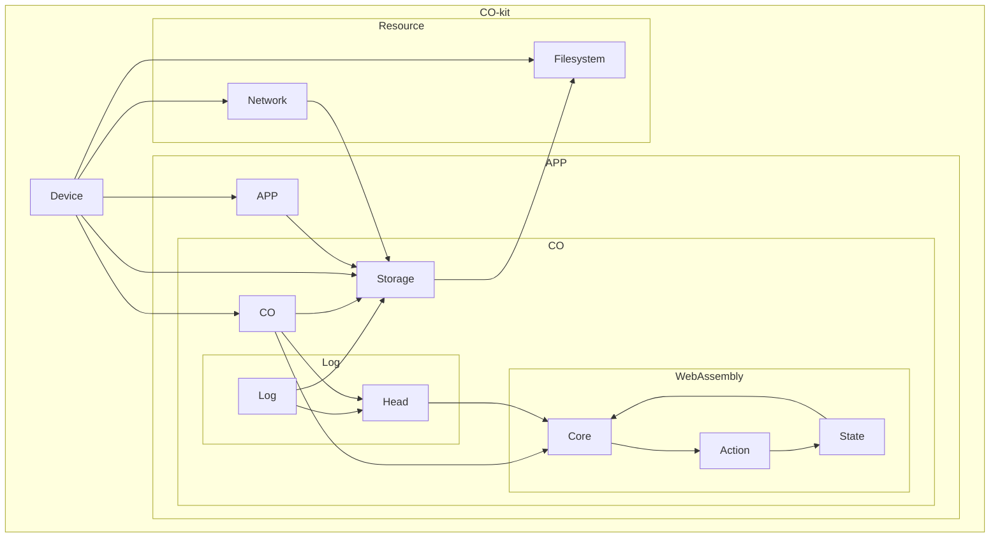

# Architecture
In this chapter, we want to share an overview of CO-kits components and how they work together.
In the introductory chapter, we already explained the [scope](../introduction/about-co-kit.md) of CO-kit and its key [features](../introduction/features.md) and [objectives](../introduction/why.md). The following will be a technical overview.

## Overview
### High-Level Components

### Components
- [Device](./usage/os-specifics.md): The platform host.
	- [Network](../reference/network.md): The platform network interface.
	- Filesystem: File based persistence.
	- App: An Application using CO-kit.
		- [Storage](../reference/storage.md): Content addressed storage.
		- [CO](../reference/co.md): Virtual room for collaboration.
		- [Log](../reference/log.md): Conflict-free replicated event stream.
			- Head: Specific point in the Log.
		- [Core](../reference/core.md): Actions to State Reducer.
			- Action: A change operation.
			- State: A materialized state based on the actions.
