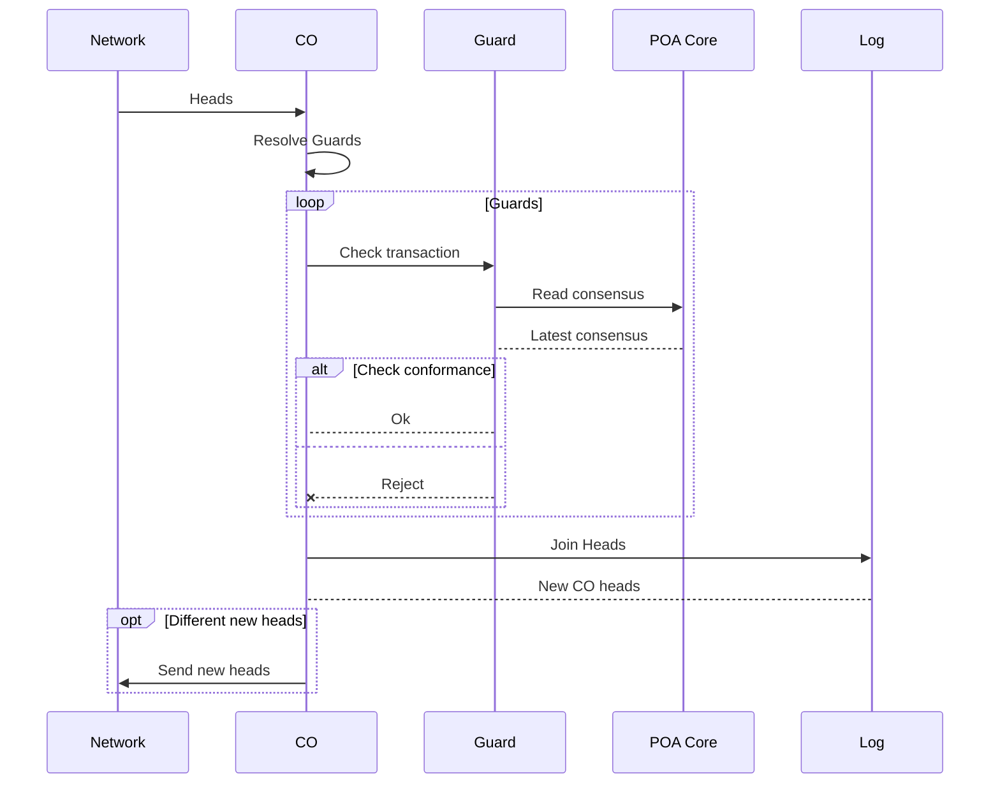

# Guards
Guards are checks for transactions.  
They serve as a sort of "police" for transactions, deciding which transactions make it into the [Log](../reference/log.md) and which do not.

New transactions will be checked by the configured Guards of a CO and will be rejected if not all Guards succeed.  
Just like [Cores](../reference/core.md), Guards are pure functions, are compiled to WebAssembly, and are registered to COs.

This mechanism is used as the basis for implementing consensus algorithms and checks that are true for every transaction in a CO.

```admonish tip
Guards are not [Permissions](../reference/permissions.md).

Guards should be designed to return the same result independent of the order of the transactions.

Permissions are order-dependent.
```

Technically:  
Guards reject transactions from a peer immediately, before those transactions reach the conflict resolution of the [CRDT](../glossary/glossary.md#crdt).  
Therefore, transactions rejected by Guards will not make it to the [CO](../reference/co.md), even if they would become valid when other peers join transactions.

```admonish info title="COKIT and GUARD"
GUARD is the optional **trust layer extension** for COKIT. It adds advanced governance, policy enforcement and trust verification on top of the open COKIT platform.

GUARD implementations live in a separate repository: **`guard`**. This repository is source-available under the Guard Source License (CGSL-1.0) — anyone can inspect and audit the trust logic.

The COKIT repository contains the guard **interfaces** (traits and hooks), behind the `guard` feature flag (`--features guard`). GUARD **implementations** — including the participant guard in `co-core-co` and the PoA consensus guard — require the `co-guard` package.

COKIT builds and runs fully without GUARD. See the [Legal Notice](../license/legal-notice.md) for details.
```

## Guard Implementations
### Check: Is Participant
The simplest Guard is that a peer must be a participant in order to write transactions to the [CO](../reference/co.md).

This Guard is implemented in `co-core-co` ([`Co`](/crate/co_core_co/struct.Co.html#impl-Guard<S>-for-Co)) and requires the `co-guard` package to run.

### Check: POA Consensus Conformance
The Proof-of-Authority Consensus mechanism checks new transactions for conformance to the latest reached consensus, and will reject the transaction if it does not conform.

This guard is part of **GUARD** and will be available separately.

Technically:
the Guard accesses the state of the [Proof-of-Authority Core](../reference/core.md#co-core-poa) and checks the transaction against it.

#### Diagram: How POA Consensus works internally
This sequence shows how Guards process new transactions received from the network:


