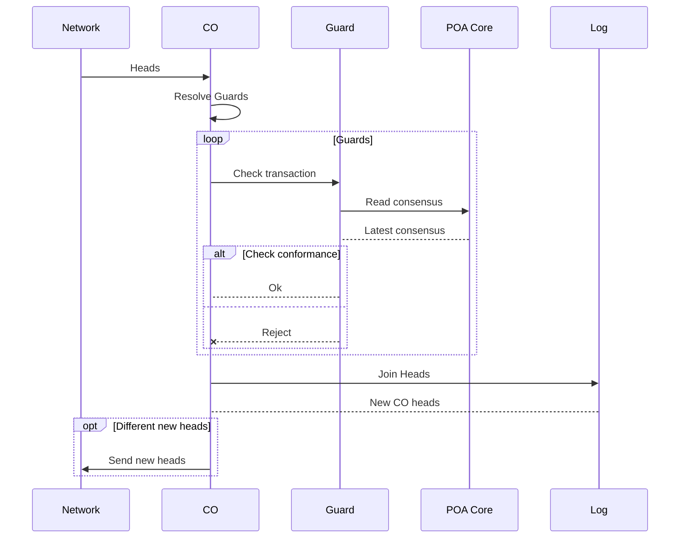

# Guards
Guards are checks for transactions.
They serve as a sort of "police" for transactions and decide which transactions will make it into the [Log](../reference/log.md) and which don't.

New transactions will be checked by the configured guards of a CO and will be rejected if not all guards succeed.
Just like [Cores](../reference/core.md), Guards are pure functions, are compiled to WebAssembly, and registered to COs.

This mechanism is used as the basis for implementing consensus algorithms and checks that are true for every transaction in a CO.

```admonish tip
Guards are not [permissions](../reference/permissions.md).

Guards should be designed to return the same result independent from the order of the transactions.

Permissions are order-dependent.
```

Technically:
Guards reject transactions from a peer immediately and before they reach the conflict resolution of the [CRDT](../glossary/glossary.md#crdt).
This way they can't make it into the [CO](../reference/co.md), even if they possibly would be valid when other peers join transactions.

## Built-in guards
### Check: Is Participant
The simplest guard is that a peer must be a participant in order to write transactions to the [CO](../reference/co.md).

This guard is implemented in [`co-core-co`](/crate/co_core_co/struct.Co.html#impl-Guard<S>-for-Co).

### Check: POA Consensus conformance
The Proof-of-Authority Consensus mechanism checks new transactions for conformance for the latest reached consensus and will reject the transaction if not.
Technically, the guard accesses the state of the [Proof-of-Authority Core](../reference/core.md#co-core-poa) and checks the transaction against it.

#### Diagram: How POA Consensus work internally
This sequence shows how guards process new transactions received from the network:


