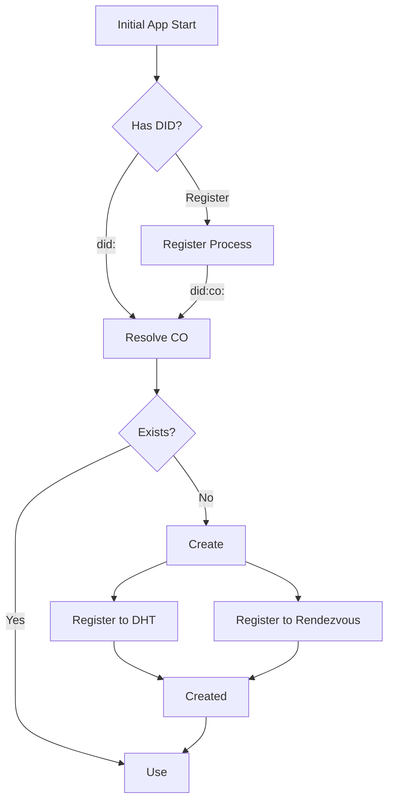

# Identity

co-sdk uses a Decentralized Identifier (DID) as the fundamental identifier for identities. A DID is structured to align with the [W3C DID Core specification](../https://www.w3.org/TR/did-1.0/), typically of the form: 

`did:<method>:<method-specific-identifier>`

for example:

`did:example:alice123`

### Lifecycle
|Step|Description|
|---|---|
|**Construct/Parse**|`DID::parse("did:method:id")` creates the internal byte-array representation.|
|**Validate**|Ensures proper structure (3 parts, non-empty, UTF-8/permitting percent-encoding).|
|**Use in Code**|Stored as `Vec<u8>` for both `method` and `identifier`.|
|**Serialize/Display**|Outputs via `Display`, producing valid DID strings.|
|**Extend to URL**|`join(...)` creates DID URLs with valid components.|

### Example
```rust
use did_toolkit::did::DID;

// Parse and inspect
let did = DID::parse("did:example:foo%20bar").unwrap();
println!("Method: {}", String::from_utf8_lossy(&did.method));
println!("ID: {}", String::from_utf8_lossy(&did.identifier));

// Round-trip
assert_eq!(did.to_string(), "did:example:foo%20bar");

// Generate URL variant
let url = did.join(URLParameters {
    fragment: Some(b"key-1".to_vec()),
    ..Default::default()
});
assert_eq!(url.to_string(), "did:example:foo%20bar#key-1");
```

### Usage in co-sdk
All types of DID are supported throughout the system. However the system provides a DID method itself.

#### Flow

