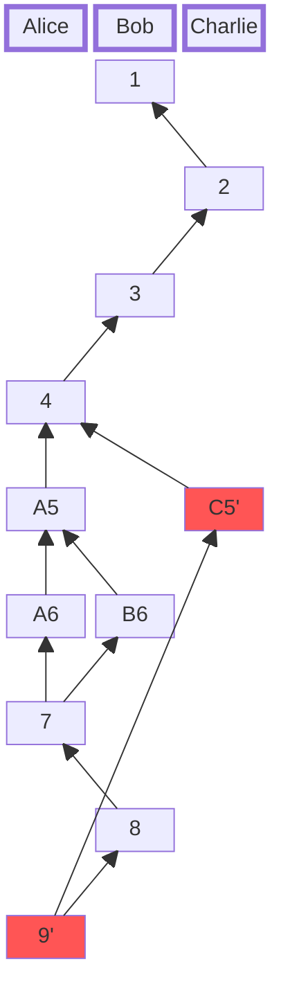

# Log
The Log is a conflict-free replicated event stream.
It is immutable, cryptographically verifiable and eventually consistent, sorted using a [Merkle-DAG](../glossary/glossary.md#merkle-dag)-based logical clock.
Arbitrary heads can be joined together at any time.
Whenever the same heads are joined, the resulting log is guaranteed to be equal.

## What makes a Log
This can be thought of as a git graph where each commit is an operation/transaction.
The heads represent the end of the log and also a specific state of the data.

## How it is used in CO-kit
Each [CO](./co.md) is event-sourced by a Log.
The [CO](../reference/co.md) state is materialized from the log through its set of [cores](../reference/core.md).
The Log is implemented in the [`co-log`](/crate/co_log/index.html) project.

### Merkle-CRDT
A Merkle‑CRDT combines the strengths of [Merkle-DAGs](../glossary/glossary.md#merkle-dag) (Merkle Directed Acyclic Graphs) and [CRDTs](../glossary/glossary.md#crdt) (Conflict-Free Replicated Data Types) to create a robust, decentralized synchronization layer.  
In this design, [CRDT](../glossary/glossary.md#crdt) payloads are embedded within [Merkle‑DAG](../glossary/glossary.md#merkle-dag) nodes, allowing each update to serve as a self-verifying event in a [content-addressed](../glossary/glossary.md#cid) history.  
This simplifies causality tracking and state merging without relying on messaging guarantees.

The Merkle‑CRDT provides Merkle‑Clocks, which function as logical clocks for capturing causality and ordering.  
This approach enables per‑object causal consistency, allowing participants to synchronize efficiently, even in unreliable networks.

Merkle‑CRDTs shine in highly-distributed and ad‑hoc environments (e.g. mobile, browser, or IoT networks) because they eliminate the need for consensus mechanisms or strict messaging protocols.  
Instead, convergence is ensured through immutable, verifiable [Merkle-DAG](../glossary/glossary.md#merkle-dag) history, and [CRDT](../glossary/glossary.md#crdt) semantics embedded within each node.

## Example
This example shows how sorting works with sample data.  
In this example the number represents the logical clock.
1. Illustrating a graph with three participants.
2. The resulting sorted list without the heads `9'` and thus `C5'`.
3. The resulting sorted list with the heads `9'` and thus `C5'`.

Whenever there is a causal "conflict" we have two or more heads for a logical clock.

### 1. Graph

### 2. Sequence before `'`

### 3. Sequence after  `'`

## References
- [Merkle-CRDTs: Merkle-DAGs meet CRDTs](https://arxiv.org/abs/2004.00107)
