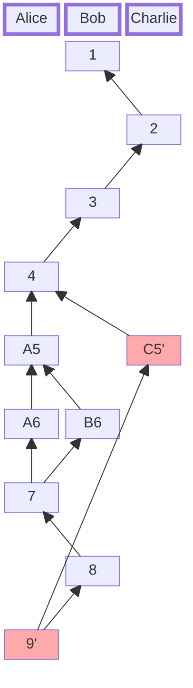

# Log
The Log is a conflict-free replicated event stream which is immutable and cryptographically verifiable.
It is (eventually consistent) sorted using a Merkle-DAG-based logical clock.
Arbitrary heads can be joined together at any time.
Whenever the same heads are joined the resulting log is guaranteed to be equal.

## What makes a Log
This can be thought of like a git graph where each commit is an operation.
The heads represent the end of the log and also a specific state of the data.

## How it is used in CO-kit
Each [CO](./co.md) is event-sourced by a Log.
The CO state is materialized from the log through its set of cores.
The Log is implemented in the `co-log` project.

## References
- https://arxiv.org/abs/2004.00107

## Example
This example shows how sorting works with sample data.
In this example the number represents the logical clock.
1. Illustrating a graph with three participants.
2. The resulting sorted list without the heads `9'` and thus `C5'`.
3. The resulting sorted list with the heads `9'` and thus `C5'`.

Whenever there is a causal "conflict" we got two or more heads for a logical clock.

### 1. Graph

### 2. Sequence before `'`

### 3. Sequence after  `'`

