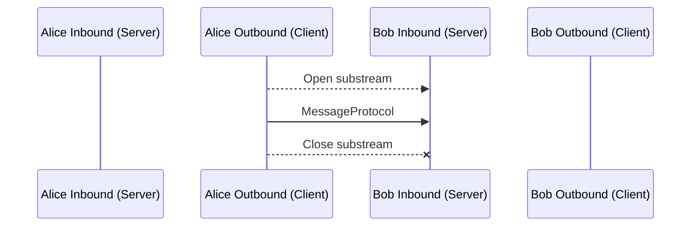

# Network

## libp2p Protocols
libp2p, (short for “library peer-to-peer”) is a peer-to-peer (P2P) networking framework that enables the development of P2P applications. It consists of a collection of protocols, specifications, and libraries that facilitate P2P communication between network participants or, in other words, peers.

### Protocol: mDNS (libp2p)
- Used for **local peer discovery** via multicast DNS (RFC 6762).
- Peers broadcast `_p2p._udp.local` PTR queries, and libp2p-capable nodes respond with their multiaddresses.    
- In Rust, the `libp2p::mdns` crate offers a `NetworkBehaviour` (e.g., `TokioMdns`) to integrate mDNS discovery.

### Protocol: Noise (libp2p transport)
The [Noise Protocol Framework](https://noiseprotocol.org/) is a widely-used encryption scheme that allows for secure communication by combining cryptographic primitives into patterns with verifiable security properties.
https://docs.libp2p.io/concepts/secure-comm/noise/

### Protocol: Ping (libp2p)
The libp2p ping protocol is a simple liveness check that peers can use to test the connectivity and performance between two peers. The libp2p ping protocol is different from the ping command line utility ([ICMP ping](https://en.wikipedia.org/wiki/Internet_Control_Message_Protocol)), as it requires an already established libp2p connection.

A peer opens a new stream on an existing libp2p connection and sends a ping request with a random 32 byte payload. The receiver echoes these 32 bytes back on the same stream. By measuring the time between the request and response, the initiator can calculate the round-trip time of the underlying libp2p connection. The stream can be reused for future pings from the initiator.

#### Example
[Kubo](https://github.com/ipfs/kubo) exposes a command line interface to ping other peers, which uses the libp2p ping protocol.

```ipfs ping /ipfs/QmYwAPJzv5CZsnA625s3Xf2nemtYgPpHdWEz79ojWnPbdG/ping PING /ipfs/QmYwAPJzv5CZsnA625s3Xf2nemtYgPpHdWEz79ojWnPbdG/ping (QmYwAPJzv5CZsnA625s3Xf2nemtYgPpHdWEz79ojWnPbdG) 32 bytes from QmYwAPJzv5CZsnA625s3Xf2nemtYgPpHdWEz79ojWnPbdG: time=11.34ms```

### Protocol: Identify (libp2p)
The `identify` protocol allows peers to exchange information about each other, most notably their public keys and known network addresses.

The basic identify protocol works by establishing a new stream to a peer using the identify protocol id shown in the table above.

When the remote peer opens the new stream, they will fill out an `Identify` containing information about themselves, such as their public key, which is used to derive their `PeerId`

Importantly, the `Identify`message includes an `observedAddr`field that contains the [multiaddr](https://docs.libp2p.io/concepts/appendix/glossary/#multiaddr) that the peer observed the request coming in on. This helps peers determine their NAT status, since it allows them to see what other peers observe as their public address and compare it to their own view of the network.

#### identify/push

|**Protocol id**|spec & implementations|
|---|---|
|`/ipfs/id/push/1.0.0`|same as identify|

A slight variation on `identify`, the `identify/push` protocol sends the same `Identify` message, but it does so proactively instead of in response to a request.

This is useful if a peer starts listening on a new address, establishes a new relay circuit, or learns of its public address from other peers using the standard `identify` protocol. Upon creating or learning of a new address, the peer can push the new address to all peers it’s currently aware of. This keeps everyone’s routing tables up to date and makes it more likely that other peers will discover the new address.


## Other Protocols
### Protocol: didcomm (1io)
Network protocol to send and receive didcomm encoded message to a given peer. Uses a libp2p sub-stream for message transfer.

#todo

#### Protocol
`didcomm/2`

#### ABNF
```rust
Message      ::= <VarInt> <DidCommBytes>
DidCommBytes ::= 1*OCTET ; application/didcomm-encryptet+json
```

#### Messages
##### Invite Request
```rust
enum InviteSubject
{
  /// Create new CO if invite is being accepted.
  New,
  /// Join CO if invite is being accepted.
  Co(COID),
  /// Create new CO from template if invite is being accepted.
  Template(COID),
}
struct InviteRequestPayload
{
  /// Sender.
  from: DID,
  from_peer: PeerId,
  from_addresses: Vec<Multiaddress>,
  /// Recipent.
  to: Option<DID>,
  // Subject.
  sub: InviteSubject,
  // options
  timeout: Option<NumericDate>,
}

```

##### Join Request
Request to join a known CO by asking a known participant. Used when `from`wants to join a CO which exists on some device of `to`

```rust
enum JoinSubject
{
  Co(COID),
  Invite(InviteRequest),
}
struct JoinRequestPayload
{
  // Sender.
  from: DID,
  
  // Recipent.
  to: DID,
  /// Subject.
  sub: JoinSubject
}
```

##### Join Response
```rust
struct JoinResponsePayload
{
  // Sender.
  from: DID,
  
  // Recipent.
  to: DID,
  // Subject. JoinRequest Hash.
  sub: Hash,
}
```

#### Flow



### Protocol: bitswap (IPFS)
Bitswap is a core module of IPFS for exchanging blocks of data. It directs the requesting and sending of blocks to and from other peers in the network. Bitswap is a _message-based protocol_ where all messages contain want-lists or blocks. 

[IPFS](https://docs.ipfs.tech/) breaks up files into chunks of data called blocks. These blocks are identified by a content identifier (CID).

#### CID
A _content identifier_, or CID, is a label used to point to material in IPFS. It doesn't indicate _where_ the content is stored, but it forms a kind of address based on the content itself. CIDs are short, regardless of the size of their underlying content.

[See more](https://docs.ipfs.tech/concepts/content-addressing/#what-is-a-cid)

#### Refs
https://docs.ipfs.tech/concepts/bitswap/

