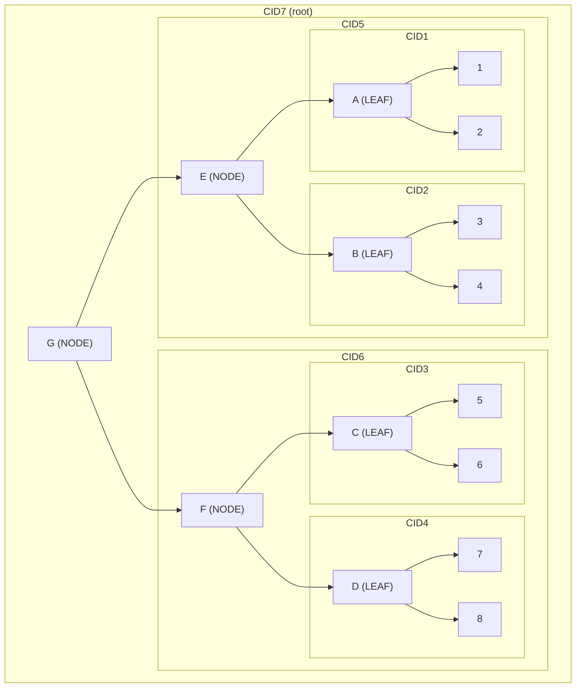

# API Overview

Common APIs are exported by the `co-primitives` package.
They are used across [cores](../reference/core.md) and Applications.

Table of Contents:

<!-- toc -->

## `BlockStorage`

The block storage API is used to set and get content-addressed blocks of data.
The `BlockStorageExt` trait extends this with convenience methods like directly setting a block from data.

```rust
# use co_storage::MemoryBlockStorage;
# use co_primitives::{BlockStorage, BlockStorageExt};
#
# #[tokio::main]
# async fn main() {
let storage = MemoryBlockStorage::new();

// set block
let cid = storage.set_serialized(&1).await.unwrap();

// get block
let value: i32 = storage.get_deserialized(&cid).await.unwrap();
assert_eq!(value, 1);
# }
```

For further information see:
- [Storage](../reference/storage.md)
- [co-primitives: BlockStorage](/crate/co_primitives/trait.BlockStorage.html)
- [co-primitives: BlockStorageExt](/crate/co_primitives/trait.BlockStorageExt.html)

## `CoMap`
`CoMap` stores Key/Value pairs using the IPLD data model in a content-addressed fashion.
Works like a hash map but async and sorted by keys.

For further information see:
- [co-primitives: CoMap](/crate/co_primitives/struct.CoMap.html)
- [Glossary: IPLD](../glossary/glossary.md#ipld)
- [Glossary: content addressing (CID)](../glossary/glossary.md#cid)

### Read
Example of how to read a `CoMap`.

```rust
# use co_storage::MemoryBlockStorage;
# use co_primitives::CoMap;
# use futures::TryStreamExt;
#
# #[tokio::main]
# async fn main() {
let storage = MemoryBlockStorage::new();
let mut map = CoMap::<i32, i32>::default();
map.insert(&storage, 1, 10).await.unwrap();
map.insert(&storage, 2, 20).await.unwrap();
map.insert(&storage, 3, 30).await.unwrap();

// get
assert_eq!(map.get(&storage, &1).await.unwrap(), Some(10));

// contains
assert_eq!(map.contains(&storage, &1).await.unwrap(), true);
assert_eq!(map.contains(&storage, &4).await.unwrap(), false);

// stream
assert_eq!(
    map.stream(&storage).try_collect::<Vec<(i32, i32)>>().await.unwrap(),
    vec![(1, 10), (2, 20), (3, 30)]
);
# }
```

### Write
Example of how to write a `CoMap`.

```rust
# use co_storage::MemoryBlockStorage;
# use co_primitives::CoMap;
# use futures::TryStreamExt;
#
# #[tokio::main]
# async fn main() {
let storage = MemoryBlockStorage::new();
let mut map = CoMap::<i32, i32>::default();

// insert
map.insert(&storage, 1, 10).await.unwrap();
assert_eq!(
    map.stream(&storage).try_collect::<Vec<(i32, i32)>>().await.unwrap(),
    vec![(1, 10)]
);

// remove
map.remove(&storage, 1).await.unwrap();
assert_eq!(
    map.stream(&storage).try_collect::<Vec<(i32, i32)>>().await.unwrap(),
    vec![]
);
# }
```

### Transactions
To optimize storage access, a transaction-based API is available and recommended to be used.

```rust
# use co_storage::MemoryBlockStorage;
# use co_primitives::CoMap;
# use futures::TryStreamExt;
#
# #[tokio::main]
# async fn main() {
let storage = MemoryBlockStorage::new();
let mut map = CoMap::<i32, i32>::default();
let mut transaction = map.open(&storage).await.unwrap();
transaction.insert(1, 10).await.unwrap();
transaction.insert(2, 20).await.unwrap();
transaction.insert(3, 30).await.unwrap();
transaction.remove(1).await.unwrap();
map.commit(transaction).await.unwrap();
assert_eq!(
    map.stream(&storage).try_collect::<Vec<(i32, i32)>>().await.unwrap(),
   vec![(2, 20), (3, 30)]
);
# }
```

## `CoSet`
`CoSet` stores values using the IPLD data model in a content-addressed fashion.
Works like a hash set but async and sorted by values.

For further information see:
- [co-primitives: CoSet](/crate/co_primitives/struct.CoSet.html)
- [Glossary: IPLD](../glossary/glossary.md#ipld)
- [Glossary: content addressing (CID)](../glossary/glossary.md#cid)

## `CoList`
`CoList` stores values by order, using the IPLD data model in a content-addressed fashion.
Works like a vector but async.

The used key type is `CoListIndex`, which internally uses rational numbers.
This way we can insert between existing values without the need to rewrite all values.

For further information see:
- [co-primitives: CoList](/crate/co_primitives/struct.CoList.html)
- [co-primitives: CoListIndex](/crate/co_primitives/struct.CoListIndex.html)
- [Glossary: IPLD](../glossary/glossary.md#ipld)
- [Glossary: content addressing (CID)](../glossary/glossary.md#cid)

## `BlockSerializer`
This is a convenience type to create a `Block` from data that support `serde::Serialize`.
It uses the DAG-CBOR encoding.

```rust
# use co_primitives::BlockSerializer;
# use serde::Serialize;
#
#[derive(Debug, Serialize)]
struct Test {
	hello: String,
}
#
# fn main() {
let test = Test { hello: "world".to_owned() };
let block = BlockSerializer::default().serialize(&test).unwrap();
assert_eq!(block.cid().to_string(), "bafyr4iahzl6dyblh5gjfk5lo46xkkfk7fvxhyot4636rdglz3n5tayegd4");
assert_eq!(block.data(), [161, 101, 104, 101, 108, 108, 111, 101, 119, 111, 114, 108, 100]);
# }
```

For further information see:
- [co-primitives: BlockSerializer](/crate/co_primitives/struct.BlockSerializer.html)
- [Glossary: DAG-CBOR](../glossary/glossary.md#dag-cbor)

There is also a convenient method to convert from/to DAG-CBOR:

### `to_cbor`
Convenient method to serialize to DAG-CBOR:

```rust
# use co_primitives::to_cbor;
# use serde::Serialize;
#
#[derive(Debug, Serialize)]
struct Test {
	hello: String,
}
#
# fn main() {
let test = Test { hello: "world".to_owned() };
let data = to_cbor(&test).unwrap();
assert_eq!(&data, [161, 101, 104, 101, 108, 108, 111, 101, 119, 111, 114, 108, 100]);
# }
```

For further information see:
- [co-primitives: to_cbor](/crate/co_primitives/fn.to_cbor.html)
- [Glossary: DAG-CBOR](../glossary/glossary.md#dag-cbor)

### `from_cbor`
Convenient method to deserialize from DAG-CBOR:

```rust
# use co_primitives::from_cbor;
# use serde::Serialize;
#
#[derive(Debug, Serialize, PartialEq)]
struct Test {
	hello: String,
}
#
# fn main() {
let data: Test = from_cbor(&[161, 101, 104, 101, 108, 108, 111, 101, 119, 111, 114, 108, 100]).unwrap();
assert_eq!(data, Test { hello: "world".to_owned() });
# }
```

For further information see:
- [co-primitives: from_cbor](/crate/co_primitives/fn.from_cbor.html)
- [Glossary: DAG-CBOR](../glossary/glossary.md#dag-cbor)

## NodeBuilder
The NodeBuilder creates a graph for a list of ever-growing items.

```admonish info
For demonstration purposes we use a node count of `2`, the default is `172`.
```

```rust
# use co_primitives::NodeBuilder;
#
# fn main() {
// build
let mut builder = NodeBuilder::<u8>::new(2, DefaultNodeSerializer::new());
builder.push(1).unwrap();
builder.push(2).unwrap();
builder.push(3).unwrap();
builder.push(4).unwrap();
builder.push(5).unwrap();
builder.push(6).unwrap();
builder.push(7).unwrap();
builder.push(8).unwrap();

// blocks
let (_root, blocks) = builder.into_blocks().unwrap();
assert_eq!(blocks.len(), 7);
# }
```

This builds a graph like this:



For further information see:
- [co-primitives: NodeBuilder](/crate/co_primitives/struct.NodeBuilder.html)

### `NodeStream`
The `NodeStream` is used to read a graph created with `NodeBuilder` in an async manner as a futures stream:

```rust
# use co_primitives::{BlockStorage, DefaultNodeSerializer, NodeBuilder, NodeStream};
# use futures::TryStreamExt;
# use co_storage::MemoryBlockStorage;
#
# #[tokio::main]
# async fn main() {
let storage = MemoryBlockStorage::default();

// build and store
let mut builder = NodeBuilder::new(2, DefaultNodeSerializer::new());
for i in 0..10 {
	builder.push(i).unwrap();
}
let (root, blocks) = builder.into_blocks().unwrap();
for block in blocks {
	storage.set(block).await.unwrap();
}

// stream
let list = NodeStream::from_link(storage.clone(), root.into())
	.try_collect::<Vec<i32>>()
	.await
	.unwrap();
assert_eq!(list[..], [0, 1, 2, 3, 4, 5, 6, 7, 8, 9]);
# }
```


For further information see:
- [co-primitives: NodeStream](/crate/co_primitives/struct.NodeStream.html)

## References
- [co-primitives](/crate/co_primitives/index.html)
- [Core](../reference/core.md)
